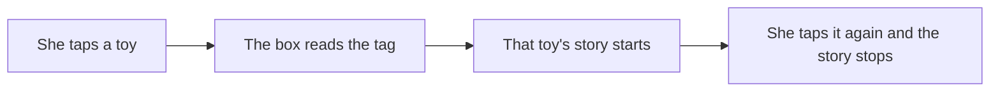
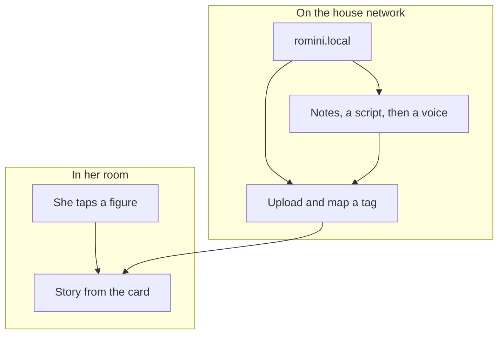
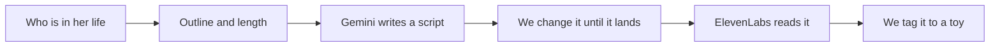

Bedtime still happens on the nights my wife and I are both working late. One of us is in the room. The other one is still at a laptop. Romy gets one voice. I wanted her to hear the other one too, and I didn't want a screen in there to do it.

<!--more-->

<!-- PHOTO box.webp: the finished box where she uses it. Toy on the plate if you have the shot. This is also the post hero. Not in the repo. -->

[{:style="max-height:500px"}](/assets/2026-10-03-building-a-story-box-for-romy/box.webp)

## What it had to be

Something she would reach for. If I am the only person who enjoys it, it ends up in a drawer.

Her hands, not an app. Tap a thing, get a story. Tap it again, it stops. That is the whole interface. A tablet will play a story and then offer the next thing, with the light of the screen in a dark room. I don't want bedtime to be a negotiation with an app.

Objects she already has. A small NFC tag on a toy. A tag in a book. I didn't want a new gadget she has to learn, and I didn't want a special cartridge that only works with one company's stories.

Our voices, including the nights one of us is missing. We already read to her. The gap is the parent who is not in the room, so a book can be one of us, recorded, and played back from the tag in the cover.

The books are not the only stories worth hearing. If something happened today, she should get a story about that. About her, about us, about the house and the toys and whoever else is in the week. That one is more fun than a recording, and it is not either of our voices.

The box has to keep working when the house internet doesn't. Listening is a file on a card. The network is for us, later, when we add something.

## How she uses it

RoMini is a box. A Raspberry Pi, a speaker, an NFC reader and no screen. She never sees a menu.

She taps a tagged toy on the pad and the story for that toy starts. She taps it again and it stops. Tap once more and it carries on from the same place. Each toy keeps its own place, so two of them are not sharing one bookmark.

A book works the same way. The tag is on the book. She taps the book on the box and hears one of us reading it.

<!-- PHOTO toy.webp: a tagged toy on the box, mid-story if the light or the speaker makes that obvious. -->

[{:style="max-height:500px"}](/assets/2026-10-03-building-a-story-box-for-romy/toy.webp)

<!-- PHOTO book.webp: a book with the tag visible, on the box or open so the tag shows. -->

[{:style="max-height:500px"}](/assets/2026-10-03-building-a-story-box-for-romy/book.webp)

When power comes back she gets a light and a short ready sound, so the box can announce itself without a screen. The first box has one real button, and that button puts it to sleep cleanly. Loudness is ours to set. She does not get a volume knob yet.

## What went in the box

The reader sits under a wooden lid. Wood is fine. A metal lid would block the tag. The tags are the clear stick-on kind, fixed to toys and books she already owns. The computer is a Raspberry Pi 4. Sound comes out of a powered speaker and amp. A battery hat means it can sit away from a socket, something for her to hold during bedtime. The card is split so a yanked plug is less likely to take the system with it. Stories live on that card.

The parts list, the wiring and the "please don't yank it" notes are in the repo: [hardware](https://github.com/mzworthington/RoMini/blob/main/docs/hardware.md). This post is not that list.

Listening never waits on that second half. If the laptop is shut, the toy still works.

## On the bench

The box came together on the bench before it was a thing she could put a toy on. A Pi, the NFC reader, a speaker and a lot of wiring that does not belong in her room.

Most of the player was written before that wiring existed. On a laptop the same software pretends to be the box: fake reader, fake buttons, real library. I could paste a tag id, check that a story starts, stops and remembers its place, and only then move those rules onto the Pi.

<!-- PHOTO bench.webp: the Pi during the build, reader and wiring still out in the open. -->

[{:style="max-height:500px"}](/assets/2026-10-03-building-a-story-box-for-romy/bench.webp)

<!-- PHOTO parts.webp: the pile of parts before they went in the box. Optional if bench.webp already shows this. -->

[{:style="max-height:500px"}](/assets/2026-10-03-building-a-story-box-for-romy/parts.webp)

## The wooden cube

The wiring needed a box she can hold. One sheet of 3 mm birch, cut as a 130 mm cube. The lid carries the mark as a shallow engrave, about 0.5 mm, so the wood stays closed. The walls and the lid are glued. The bottom is not. Four screws into dowels in the corners let that panel come off when the Pi, the battery or the card needs a hand.

A shelf halfway up those dowels lifts the Pi toward the reader under the lid. The front is a grille. Behind it, a smaller plate has two openings for a pair of small enclosed speakers. They still need an amp.

The cut file, the shop letter and these renders are in the repo: [fabrication](https://github.com/mzworthington/RoMini/blob/main/docs/fabrication.md).

## The page we use

She never opens this. We do, on the house network, at `romini.local`. Upload a file, map a tag, set how loud it is, see what is actually on the pad without walking in.

The shots here are the parent pages from the repo. The frog is sample data so the screens have something to show. On our box the names are whatever we have stuck a tag to. A few labels in those shots (a night-light colour, a DAC name) are further along than this wooden box, or they describe a board it does not use. What I actually look at is the figure, the place in the story and the volume cap.

The live player is the one I open when I want to know if she is mid-story: which figure, how far through, and the volume cap. The cap is the point. Bedtime should not be able to creep up to the speaker's idea of loud.

[{:style="object-fit:contain;height:auto;max-height:none"}](/assets/2026-10-03-building-a-story-box-for-romy/player.webp)

The library is a folder with a form in front of it. Drop in an MP3, give it a title, point it at a figure. Unassigned files sit there until they have a toy. I can play a track back on the laptop before it is hers.

[{:style="object-fit:contain;height:auto;max-height:none"}](/assets/2026-10-03-building-a-story-box-for-romy/library.webp)

Figures are the other direction. The reader sees a tag, we name it, and we choose the file. A tag with no story is a toy that does nothing, which is worse than no toy, so the page keeps those visible.

[{:style="object-fit:contain;height:auto;max-height:none"}](/assets/2026-10-03-building-a-story-box-for-romy/figures.webp)

Volume lives on the system page, next to whether a figure is on the plate. The keys for drafting and speaking a story are on this page too. The page shows that they are set. It does not show the secrets.

[{:style="object-fit:contain;height:auto;max-height:none"}](/assets/2026-10-03-building-a-story-box-for-romy/settings.webp)

The same screens, with a bit less of me talking, are written up as [the parent dashboard](https://github.com/mzworthington/RoMini/blob/main/docs/dashboard.md).

## A story about today

Recording ourselves is the book. Put the tag in the cover, read it once, and she can hear that parent again. I wanted another kind of track too. One we would not sit down and perform. A story that only exists because this week happened, told in a voice that is not mine and not my wife's, then stuck to a toy she already takes to bed.

We start with the people in her life. Each one is a name and a bit of background: who they are to her, how they behave, what she would recognise. Romy is in that list on purpose. So are we. So is anyone else who keeps turning up, toys included. Those notes stay on the box. The next story should not have to be told who lives in the house, or what is around her.

[{:style="object-fit:contain;height:auto;max-height:none"}](/assets/2026-10-03-building-a-story-box-for-romy/characters.webp)

The brief for one story is small. We tick who is in it. We write an outline, a few lines on what has to happen. We set how long it should be. That is the whole ask. Gemini writes the script from those notes and from the characters we have already described.

We read that script before anyone speaks it. This is the part that matters. The first draft is a start. We change the lines, the ending, the bit where she would lose the thread. Titles keep her name as Romy. In the script she is Rowmy, and we are Maama and Baaba, because that is how the stories are said aloud. Marks in square brackets, a pause or a whisper or a yawn, are instructions to the reading. They are not words for her to hear.

When the words are the ones we want, we send that script to ElevenLabs and pick a voice. It comes back as an MP3 on the box, the same kind of file as a book we recorded. We bind it to a figure. She taps that toy and gets a story about her, about us and about the place she is actually in. Next week we open the same notes, change the outline and do it again.

Making that story uses the network only when we ask: once for Gemini to draft, once for ElevenLabs to read. Listening does not.

[{:style="object-fit:contain;height:auto;max-height:none"}](/assets/2026-10-03-building-a-story-box-for-romy/stories.webp)

## If you want the build

The code is [on GitHub](https://github.com/mzworthington/RoMini). Start with the [parts and wiring](https://github.com/mzworthington/RoMini/blob/main/docs/hardware.md) if you are building a box, the [wooden cube](https://github.com/mzworthington/RoMini/blob/main/docs/fabrication.md) if you want the sheet the shop cuts, or the [parent pages](https://github.com/mzworthington/RoMini/blob/main/docs/dashboard.md) if you want to see the screens without one. How the player is put together, including the laptop that pretends to be a Pi, is [the architecture note](https://github.com/mzworthington/RoMini/blob/main/docs/architecture.md).

This post is about why I started. She taps a thing she already loves on a wooden box, and she gets a story. Sometimes that is one of us, recorded. Sometimes it was written that afternoon, about her and the people around her, and a voice that is neither of ours reads it to her.
