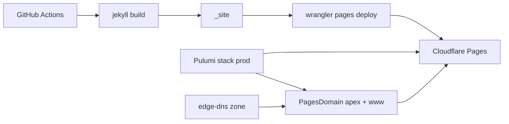

# 0001. Cloudflare Pages static hosting with Pulumi and Wrangler

## Context and Problem Statement

The personal site at `mzworthington.co.uk` was deployed to GitHub Pages via Actions. We want the same Cloudflare Pages + Pulumi hosting pattern used by ArchLens and the React Cloudflare Template: infrastructure in git, CDN control, and apex + www custom domains.

## Decision Drivers

- Reproducible deploy and DNS from the repository
- Align with existing product hosting (ArchLens / react-cloudflare-template)
- Keep the Jekyll build pipeline; only change the upload target
- Remote encrypted Pulumi state

## Considered Options

- Option A: Stay on GitHub Pages
- Option B: Cloudflare Pages via dashboard Git integration
- Option C: Pulumi for Pages/domains + GitHub Actions + Wrangler upload

## Decision Outcome

Chosen option: "**Option C**". Pulumi manages the Pages project and custom domains (`PagesDomain` for apex + `www`, with proxied CNAME DNS). CI runs `bundle exec jekyll build` and `wrangler pages deploy _site`. Apex is canonical; `_redirects` 301s www → apex.

### Consequences

- Good, because hosting matches the rest of the org stack
- Good, because `_headers` (already present) is honoured on Cloudflare Pages
- Bad, because cutover requires disabling GitHub Pages after DNS points at Cloudflare
- Zone ownership remains in edge-dns; this repo only attaches product records

## Architecture sketch

## Links

- Secrets checklist: [docs/cloudflare-secrets.md](../cloudflare-secrets.md)
- Infra: [infra/cloudflare/README.md](../../infra/cloudflare/README.md)
- Supersedes: `.github/workflows/pages.yml` (GitHub Pages)
